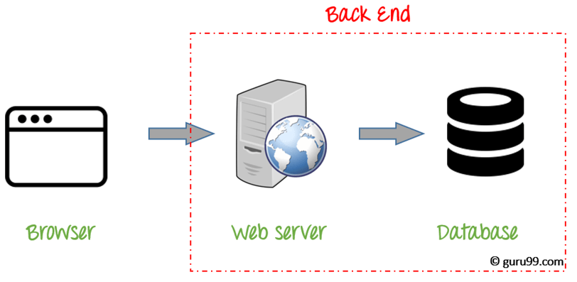
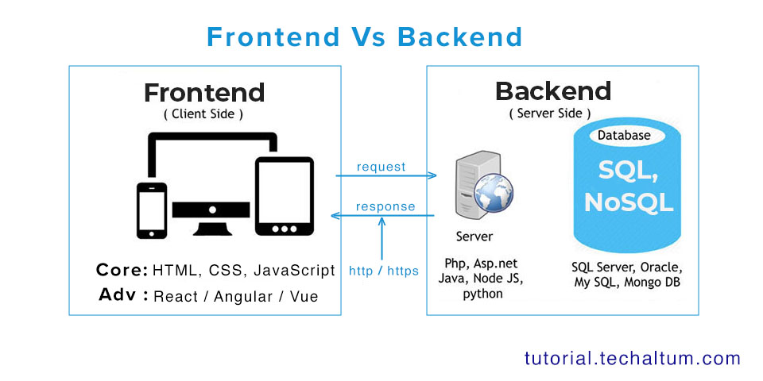
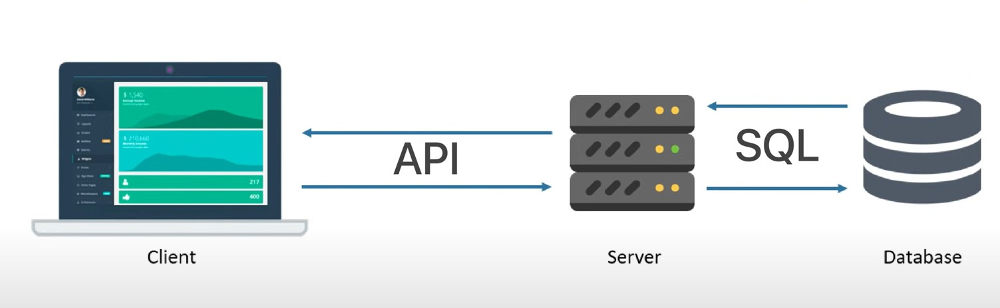

# ⚙️ Introduction to Backend Development and Its Role in Web Applications

## 🌐 Overview

Modern web applications are made up of two main parts — the **Frontend (Client-side)** and the **Backend (Server-side)**.
While the frontend is what users *see and interact with*, the backend is the *engine* that makes everything *work*.

This guide introduces you to **backend development**, its **core responsibilities**, and its **vital role** in building reliable, scalable, and secure web systems.

---

## 🎯 Learning Goals

After reading this, you will understand:

* What **backend development** means
* The **difference** between frontend and backend
* How backend fits into the **client-server model**
* Common **backend technologies and tools**
* Key **responsibilities** of backend developers
* The **lifecycle of a web request** from browser to server

---

## 💡 What Is Backend Development?

**Backend development** refers to the server-side part of a web application responsible for **data processing, logic, and communication between the frontend and the database**.

When you:

* Log into a website
* Post a comment
* Make an online purchase

…it’s the **backend** that handles those actions — verifying users, saving data, and sending the right responses back to the browser.

### 🧩 In simple terms:

> **Frontend = What users see**
> **Backend = What makes it work**

---

## 🖥️ Frontend vs Backend

| Aspect                | Frontend                      | Backend                            |
| --------------------- | ----------------------------- | ---------------------------------- |
| **Runs On**           | User’s browser (client)       | Server                             |
| **Language Examples** | HTML, CSS, JavaScript, React  | Node.js, Express, Python, Java     |
| **Main Role**         | Display data & user interface | Process data & manage logic        |
| **Focus**             | User Experience (UI/UX)       | Performance, Security, Scalability |
| **Examples**          | Buttons, forms, animations    | Login system, database handling    |

**Analogy:**
If a website were a **restaurant**,

* The **Frontend** is the waiter & menu (what you see and interact with)
* The **Backend** is the kitchen (where your order is processed)

---

## 🧠 Role of Backend in Web Applications

The backend acts as a **bridge between the client (browser/app)** and the **database**.



Here’s what it typically handles:

### 1. **Data Management**

* Fetching, updating, or deleting data from databases
* Ensuring data consistency and security
* Example: Saving user profiles, product listings, etc.

### 2. **Business Logic**

* The “rules” that define how an app behaves
* Example: “A user can only post a comment if logged in.”

### 3. **Authentication & Authorization**

* Verifying who the user is (login/signup)
* Controlling access to specific parts of the system
* Example: Admins can delete posts; users can only delete their own.

### 4. **API Handling**

* Backend exposes **APIs** (Application Programming Interfaces)
* These APIs are used by the frontend or other apps to communicate with the server
* Example: `/api/users`, `/api/products`

### 5. **Performance & Scalability**

* Handling thousands of simultaneous users efficiently
* Using caching (e.g., Redis) and load balancing

### 6. **Security**

* Protecting user data through encryption, validation, and safe database queries

---

## ⚙️ The Client-Server Architecture

Every web application runs on a **client-server model**.

### 🔄 How It Works

1. **Client (Frontend)** sends an HTTP request (e.g., login form submission).
2. **Server (Backend)** receives and processes the request.
3. **Database** stores or retrieves the data.
4. **Server** sends back an HTTP response (e.g., success message or error).
5. **Client** updates the UI based on the response.

---

## 📊 Visual Representation

Here’s a simple flow image of how backend works in a web app:





---

## 🧩 Core Components of Backend

### 1. **Server**

* The physical or virtual machine that runs your backend code
* Common examples: AWS EC2, DigitalOcean, Vercel, or localhost

### 2. **Application (Backend Code)**

* The logic layer — typically built using frameworks like **Express.js**, **NestJS**, **Django**, etc.
* Handles requests, runs business rules, and returns data.

### 3. **Database**

* Stores information persistently
* Examples:

  * **SQL Databases**: PostgreSQL, MySQL
  * **NoSQL Databases**: MongoDB, Firebase

### 4. **APIs**

* Allow communication between frontend and backend
* Usually follow the **REST** or **GraphQL** structure

---

## 🧰 Common Backend Technologies

| Category                  | Tools & Frameworks                      |
| ------------------------- | --------------------------------------- |
| **Programming Languages** | JavaScript (Node.js), Python, Java, Go  |
| **Frameworks**            | Express.js, NestJS, Django, Spring Boot |
| **Databases**             | MongoDB, PostgreSQL, MySQL, Redis       |
| **Authentication**        | JWT, OAuth2, Passport.js                |
| **Deployment**            | Docker, AWS, Netlify, Render            |
| **Version Control**       | Git, GitHub, GitLab                     |

---

# 🧠 Why TypeScript?

### 📘 Benefits over JavaScript for Backend Development

---

## 🌍 Introduction

JavaScript has been the **king of web development** for decades — powering everything from **front-end interfaces** to **server-side applications** using Node.js.
However, as applications became **larger and more complex**, developers needed a **safer, more structured, and scalable** way to manage their codebases.

That’s where **TypeScript** comes in. 💡

TypeScript is a **superset of JavaScript** — meaning it includes everything JavaScript offers **plus** extra features like **static typing**, **interfaces**, and **compile-time error checking**.

---

## ⚙️ What is TypeScript?

> **TypeScript = JavaScript + Types**

TypeScript is an **open-source programming language** developed by **Microsoft in 2012**, primarily led by **Anders Hejlsberg**, the creator of C#.

Its main goal is to make JavaScript **more reliable**, **maintainable**, and **developer-friendly** for large-scale applications by introducing **type safety** and **modern tooling**.

TypeScript files use the `.ts` (or `.tsx` for React) extension.
Before execution, they are **compiled (transpiled)** into standard JavaScript that can be run by Node.js or browsers.

---

## 🔄 How TypeScript Works

1. You write TypeScript code → `index.ts`
2. TypeScript compiler (`tsc`) converts it into JavaScript → `index.js`
3. Node.js executes the JavaScript file

```ts
// index.ts
const greet = (name: string): string => {
  return `Hello, ${name}!`;
};

// Compile to JS
npx tsc index.ts
// Run
node index.js
```

---

## 🧮 Difference Between Compile-Time and Run-Time

| Concept          | Description                                                                                                       | Example                                                 |
| ---------------- | ----------------------------------------------------------------------------------------------------------------- | ------------------------------------------------------- |
| **Compile-Time** | The phase when your TypeScript code is *checked and converted* into JavaScript. Errors are caught before running. | `let age: number = "25"; // ❌ Compile-time error`       |
| **Run-Time**     | The phase when your compiled JavaScript code is actually *executed* by Node.js or a browser.                      | `console.log(10 / 0); // ❌ Runtime behavior (infinity)` |

🧠 **TypeScript helps catch errors at compile-time**, before your app even runs — saving debugging time and preventing crashes in production.

---

## 🚀 Why Use TypeScript for Backend Development?

Here’s why TypeScript has become the **go-to choice** for modern backend developers.

---

### 1️⃣ ✅ Static Typing = Fewer Bugs

In JavaScript, types are dynamic — a variable can change from a number to a string anytime, often leading to **hidden runtime bugs**.

**JavaScript Example:**

```js
let age = 25;
age = "twenty five"; // ❌ No error, but could break logic
```

**TypeScript Example:**

```ts
let age: number = 25;
age = "twenty five"; // ❌ Compile-time error
```

💡 **TypeScript prevents bugs before they happen.**

---

### 2️⃣ 💬 Better Code Autocomplete and IntelliSense

With TypeScript, editors like VS Code provide:

* Type-aware suggestions
* Real-time error checking
* Auto-completion for objects and methods

```ts
const user = { name: "Waqar", age: 22 };
user. // shows all properties and methods automatically
```

These features make coding **faster, smarter, and less error-prone**.

---

### 3️⃣ 🧩 Type-Safe Functions and APIs

TypeScript ensures that **function parameters and return types** are always correct.

```ts
function add(a: number, b: number): number {
  return a + b;
}

add(2, 3);   // ✅ Works
add("2", 3); // ❌ Compile-time error
```

Perfect for backend APIs where incorrect data types can break systems.

---

### 4️⃣ 🧱 Strong Architecture for Large Projects

In enterprise-level backends, TypeScript provides:

* Predictable, modular structure
* Self-documenting interfaces
* Compile-time safety
* Confidence in refactoring

🧠 These benefits make scaling and maintaining large Node.js apps much easier.

---

### 5️⃣ 🧠 Interfaces and Type Definitions

Interfaces define the structure of your objects — helping maintain consistency across the project.

```ts
interface User {
  id: number;
  name: string;
  email: string;
}

function printUser(user: User) {
  console.log(`ID: ${user.id}, Name: ${user.name}`);
}
```

If you forget any required property, TypeScript instantly flags an error.

---

### 6️⃣ 🔐 Enhanced Developer Experience (DX)

TypeScript in VS Code offers:

* Auto-imports
* Hover tooltips
* “Go to definition”
* Inline documentation
* Smart refactoring

This means **less time debugging**, and **more time building**.

---

### 7️⃣ 🌐 Seamless Integration with Node.js and Express

TypeScript integrates beautifully with frameworks like **Express.js** for backend development.

```ts
import express, { Request, Response } from "express";

const app = express();

app.get("/user/:id", (req: Request, res: Response) => {
  const userId: string = req.params.id;
  res.send(`User ID is ${userId}`);
});

app.listen(3000, () => console.log("Server running on port 3000"));
```

If you mistype `req.paramz`, TypeScript catches it instantly — no runtime surprises.

---

### 8️⃣ ⚡ Modern JavaScript Features + Backward Compatibility

TypeScript supports **latest ES features** (ES2020–ES2023) before many environments do, such as:

* Optional chaining (`?.`)
* Nullish coalescing (`??`)
* Private class fields
* Async/await
* Decorators

✅ You can write modern JS code today, and TypeScript will compile it to compatible JavaScript for older environments.

---

### 9️⃣ 🧪 Safer Testing and Refactoring

Refactor function names or move files confidently — TypeScript keeps track of all type dependencies and warns you of broken references.

```ts
function calculateTax(price: number): number {
  return price * 0.1;
}

// Renaming or refactoring is now type-safe and reliable
```

---

### 🔟 🌍 Backed by a Strong Community and Ecosystem

* Developed and maintained by **Microsoft**
* Created by **Anders Hejlsberg (2012)**
* Adopted by major companies like **Google, Meta, Netflix, Airbnb, and Microsoft**
* Supported by frameworks such as **NestJS**, **Next.js**, **Angular**, **Remix**
* Thousands of official type packages (`@types/*`) for popular libraries

TypeScript is **widely used in production** by top tech companies worldwide.

---

## 🧩 Real-World Example: JavaScript vs TypeScript Backend

### ❌ JavaScript (error-prone)

```js
function getUser(id) {
  return database.find(u => u.id == id);
}

console.log(getUser()); // No error, but will crash at runtime
```

### ✅ TypeScript (safe and predictable)

```ts
function getUser(id: number): User | null {
  return database.find((u) => u.id === id) || null;
}

console.log(getUser(1)); // ✅ OK
console.log(getUser("1")); // ❌ Compile-time error
```

---

## 💬 Summary: TypeScript vs JavaScript for Backend

| Feature       | JavaScript       | TypeScript                  |
| ------------- | ---------------- | --------------------------- |
| Type Checking | ❌ None           | ✅ Compile-time checking     |
| IntelliSense  | ❌ Limited        | ✅ Full code intelligence    |
| Scalability   | ⚠️ Difficult     | ✅ Easier for large projects |
| Debugging     | ❌ Runtime errors | ✅ Compile-time detection    |
| Maintenance   | ⚠️ Hard          | ✅ Predictable structure     |
| Ecosystem     | ✅ Huge           | ✅ Huge + Growing rapidly    |
| Performance   | ⚡ Same           | ⚡ Same (compiled to JS)     |

---

## 🧱 When Should You Use TypeScript?

Use TypeScript when you’re building:

✅ APIs or backend systems
✅ Long-term, team-based projects
✅ Applications handling complex data
✅ Scalable services (e.g., microservices)
✅ Projects integrating with databases

---

## 🚀 Conclusion

TypeScript isn’t just a “trend” — it’s now the **industry standard** for modern backend development.
It offers **JavaScript’s flexibility** with the **safety of a typed language**, reducing bugs and increasing developer productivity.

Whether you’re building REST APIs, GraphQL servers, or microservices —
👉 **TypeScript helps you write cleaner, safer, and future-ready backend code.**

---

# 🚀 Setting up Node.js with TypeScript

## 📖 Introduction

TypeScript brings **static typing, better tooling, and cleaner code** to JavaScript — making Node.js development faster and more reliable.
This guide will walk you through setting up a **Node.js + TypeScript environment** from scratch, with everything you need to start building scalable backend applications.

---

## 🧰 Prerequisites

Before you begin, make sure you have:

* [Node.js (v18+)](https://nodejs.org/) installed
* npm (comes with Node.js)
* A code editor (VS Code recommended)

To verify installation:

```bash
node -v
npm -v
```

---

## ⚙️ Step 1: Initialize a New Node.js Project

When starting a new **Node.js project**, the first thing we do is initialize it with **npm** (Node Package Manager).
This step creates a file called **`package.json`**, which acts as the **heart of your project** — it stores important details like project name, version, dependencies, and scripts.

There are **two ways** to initialize a Node.js project:

### 🧩 Option 1 — Manual Setup:

```bash
npm init
```

### ⚡ Option 2 — Quick Setup (Skip Questions):

```bash
npm init -y
```

Let’s understand both 👇

---

## 🧩 `npm init` — Manual Initialization

When you run:

```bash
npm init
```

It will **ask a series of questions** to help generate your `package.json` file.

Here’s what it looks like in the terminal:

```
This utility will walk you through creating a package.json file.
It only covers the most common items, and tries to guess sensible defaults.

See `npm help init` for definitive documentation on these fields
and exactly what they do.

Use `npm install <pkg>` afterwards to install a package and
save it as a dependency in the package.json file.

Press ^C at any time to quit.
package name: (node-ts-setup)
version: (1.0.0)
description: A simple Node.js and TypeScript project
entry point: (index.ts)
test command:
git repository:
keywords:
author: Waqar Rana
license: (ISC)
```

After you answer these questions, npm will create a `package.json` file for you.

---

## 💬 Explanation of Each Question

| Question           | Description                                                        | Example Answer                                |
| ------------------ | ------------------------------------------------------------------ | --------------------------------------------- |
| **package name**   | The name of your project (lowercase, no spaces).                   | `node-ts-setup`                               |
| **version**        | The current version of your project (follows semantic versioning). | `1.0.0`                                       |
| **description**    | A short summary of your project.                                   | `Backend setup using Node.js with TypeScript` |
| **entry point**    | The file that runs first when your app starts.                     | `src/index.ts` or `index.js`                  |
| **test command**   | Command for running automated tests (optional).                    | `jest` or leave blank                         |
| **git repository** | URL of your project’s GitHub repository.                           | `https://github.com/rana/node-ts-setup`       |
| **keywords**       | Search tags for npm or GitHub (comma-separated).                   | `nodejs, typescript, backend`                 |
| **author**         | Your name (optional).                                              | `Waqar Rana`                                  |
| **license**        | License type (default: ISC). MAJOR.MINOR.PATCH                                       | `MIT` or `ISC`                                |

After confirming, npm shows:

```
About to write to /node-ts-setup/package.json:
{
  "name": "node-ts-setup",
  "version": "1.0.0",
  "description": "Backend setup using Node.js with TypeScript",
  "main": "index.js",
  "scripts": {
    "test": "echo \"Error: no test specified\" && exit 1"
  },
  "author": "Waqar Rana",
  "license": "ISC"
}

Is this OK? (yes)
```

When you type **yes**, it saves this file as `package.json`.

---

## ⚡ `npm init -y` — Quick Initialization (Auto Default)

If you don’t want to manually answer all those questions every time, you can use:

```bash
npm init -y
```

The `-y` flag means **“yes to all”**, so npm automatically fills in **default values** for every field.

**Example Output:**

```bash
Wrote to C:\Projects\node-ts-setup\package.json:
{
  "name": "node-ts-setup",
  "version": "1.0.0",
  "description": "",
  "main": "index.js",
  "scripts": {
    "test": "echo \"Error: no test specified\" && exit 1"
  },
  "keywords": [],
  "author": "",
  "license": "ISC"
}
```

🟢 The difference is that `npm init -y` skips questions and instantly creates the file with **default values**.

---

## 🧠 Difference Between `npm init` and `npm init -y`

| Feature       | `npm init`                          | `npm init -y`                     |
| ------------- | ----------------------------------- | --------------------------------- |
| Interaction   | Asks questions interactively        | Skips all questions               |
| Customization | You can manually set all values     | Uses default values               |
| Time          | Takes more time                     | Instant                           |
| Ideal For     | New projects that need custom setup | Quick test projects or prototypes |

---

## 📝 Step 2: Understanding `package.json`

Here’s an example file generated by `npm init`:

```json
{
  "name": "node-ts-setup",
  "version": "1.0.0",
  "description": "Backend setup using Node.js with TypeScript",
  "main": "index.js",
  "scripts": {
    "test": "echo \"Error: no test specified\" && exit 1"
  },
  "keywords": ["nodejs", "typescript", "backend"],
  "author": "Waqar Rana",
  "license": "ISC"
}
```

### 🔍 Explanation of Each Field

| Field           | Description                                                                                                       |
| --------------- | ----------------------------------------------------------------------------------------------------------------- |
| `"name"`        | The name of your project/package. Must be lowercase and unique if published to npm.                               |
| `"version"`     | The current version of your project. It uses [Semantic Versioning (semver)](https://semver.org/) (e.g., `1.0.0`). |
| `"description"` | A short summary of your project (helps others understand what it does).                                           |
| `"main"`        | The entry point (main file) that runs when someone imports your package.                                          |
| `"scripts"`     | Commands you can run using `npm run <script-name>` (e.g., `npm run start`).                                       |
| `"keywords"`    | Tags to help people find your package on npm.                                                                     |
| `"author"`      | Your name or team name.                                                                                           |
| `"license"`     | The type of license (e.g., `MIT`, `ISC`, `Apache-2.0`).                                                           |

---

## 🧠 Example: Adding Custom Scripts

You can add your own scripts inside `"scripts"`:

```json
"scripts": {
  "start": "node dist/index.js",
  "build": "tsc",
  "dev": "ts-node src/index.ts",
  "test": "echo \"Error: no test specified\" && exit 1"
}
```

Now you can run:

```bash
npm run dev
npm run build
npm start
```

---

## 🪄 Pro Tip: Edit Default Values

If you want to change the **default answers** that `npm init -y` uses every time, you can run:

```bash
npm config set init-author-name "Waqar Rana"
npm config set init-license "MIT"
npm config set init-version "1.0.0"
```

Now, next time you run `npm init -y`, those values will appear automatically.

---

Create a new folder for your project and initialize npm:

```bash
mkdir node-ts-setup
cd node-ts-setup
npm init or npm init -y
```

This creates a `package.json` file — the heart of your Node.js project.

---

## 🧩 Step 2: Install TypeScript and Essential Dependencies

### 🎯 Objective

Before writing TypeScript code in Node.js, we need:

* The **TypeScript compiler** to transpile `.ts` files into `.js`
* A **TypeScript runtime tool** to execute TypeScript files directly
* **Type definitions** for Node.js built-in modules (like `fs`, `path`, etc.)
* *(Optional)* A **modern runtime (`tsx`)** that runs TypeScript even faster

---

### 🌐 Official Source

Go to the official TypeScript website for documentation and learning resources:
🔗 [https://www.typescriptlang.org/](https://www.typescriptlang.org/)

Here you can:

* Read about **TypeScript features**, installation, and compiler options.
* Try out code examples in the **TypeScript Playground**.
* Learn how TypeScript adds **type safety** to JavaScript.

---

### 🧠 What We Need to Install

We need three key developer dependencies:

```bash
npm install typescript ts-node @types/node --save-dev
```

Optionally, you can also install `tsx` (a **faster modern alternative** to `ts-node`):

```bash
npm install typescript tsx @types/node --save-dev
```

---

### 🧩 Explanation of Each Package

#### 🟦 1. **typescript**

* This is the **TypeScript compiler** (`tsc`).
* It **converts TypeScript files** (`.ts`) into JavaScript files (`.js`).
* You can run the compiler manually using:

  ```bash
  npx tsc
  ```
* It uses configuration from `tsconfig.json` (which we’ll set up next).
* After compilation, all `.ts` files become plain JavaScript that Node.js can execute.

**Example:**

```bash
npx tsc index.ts
# produces index.js
node index.js
```

✅ Official page: [https://www.npmjs.com/package/typescript](https://www.npmjs.com/package/typescript)

---

#### 🟨 2. **ts-node**

* A **TypeScript execution engine** for Node.js.
* It allows you to **run TypeScript files directly** without manually compiling them to JavaScript first.
* Great for **development mode**, testing, and quick scripts.
* Behind the scenes, it compiles your code in-memory before execution.

**Example:**

```bash
npx ts-node index.ts
```

This command runs `index.ts` directly, saving time during development.

✅ Official page: [https://www.npmjs.com/package/ts-node](https://www.npmjs.com/package/ts-node)

---

#### 🟢 3. **tsx (Modern Alternative to ts-node)**

* **`tsx`** is a **next-generation TypeScript runtime** built on **ESBuild** — extremely fast and efficient.
* It lets you **run `.ts`, `.tsx`, or `.mts` files directly**, just like `ts-node`, but with **better speed** and **modern ESM support**.
* It’s used by frameworks like **Next.js**, **Vite**, and **Bun**.

**Why Developers Prefer `tsx`:**

* 🚀 Much faster than `ts-node`
* 🧠 Automatically detects `tsconfig.json`
* 🔄 Supports ES Modules, JSX, and top-level `await`
* 🔥 Perfect for modern Node.js projects

**Example:**

```bash
npx tsx index.ts
```

This command runs your TypeScript file directly — just like `ts-node`, but faster.

✅ Official page: [https://www.npmjs.com/package/tsx](https://www.npmjs.com/package/tsx)

---

#### 🟩 4. **@types/node**

* These are **TypeScript type definitions** for the Node.js API.
* They allow TypeScript to **understand Node’s built-in modules** like:

  * `fs` (file system)
  * `path`
  * `http`
  * `process`, etc.
* Without this package, TypeScript would not recognize `require`, `__dirname`, or other Node features.

**Example:**

```typescript
import fs from "fs";

fs.writeFileSync("data.txt", "Hello TypeScript!");
```

With `@types/node`, TypeScript knows that `fs.writeFileSync` expects a `string` and provides IntelliSense and error checking.

✅ Official page: [https://www.npmjs.com/package/@types/node](https://www.npmjs.com/package/@types/node)

---

#### ⚙️ 5. **--save-dev**

* This flag saves the packages under the **`devDependencies`** section in your `package.json`.
* It means these tools are **only needed during development**, not in production.

**Example:**
After installation, your `package.json` will include:

```json
"devDependencies": {
  "typescript": "^5.4.2",
  "ts-node": "^10.9.1",
  "@types/node": "^20.11.0",
  "tsx": "^4.17.0"
}
```

These tools help developers write and test code, but your **deployed backend** only needs compiled JavaScript.

---

### 🧾 `--save-dev` vs `--save` vs `-g` (Global Install)

| Flag                 | Purpose                                                           | Example                             | When to Use                                  |
| -------------------- | ----------------------------------------------------------------- | ----------------------------------- | -------------------------------------------- |
| `--save-dev`         | Saves package to `devDependencies` (used only during development) | `npm install typescript --save-dev` | For tools like TypeScript, Jest, nodemon     |
| *(Default)* `--save` | Saves package to `dependencies` (needed in production)            | `npm install express`               | For runtime libraries like Express, Mongoose |
| `-g`                 | Installs package globally on your computer                        | `npm install -g typescript`         | For CLI tools you want to use anywhere       |

---

### ⚔️ `tsc` vs `ts-node` vs `tsx`

| Feature                   | `tsc`                      | `ts-node`   | `tsx`                  |
| ------------------------- | -------------------------- | ----------- | ---------------------- |
| Compiles to JS            | ✅ Yes (creates `.js` file) | ❌ No        | ❌ No                   |
| Runs TS directly          | ❌ No                       | ✅ Yes       | ✅ Yes                  |
| Compilation method        | Writes to disk             | In-memory   | In-memory (super fast) |
| Supports ES Modules & JSX | ⚙️ Partial                 | ⚙️ Partial  | ✅ Full                 |
| Performance               | 🐢 Slowest                 | ⚡ Medium    | 🚀 Fastest             |
| Ideal For                 | Production builds          | Development | Modern dev environment |

---

### 🧳 Example Use Case

#### 1️⃣ Local install (recommended)

```bash
npm install typescript ts-node @types/node tsx --save-dev
```

* Stored inside project folder (`node_modules`)
* Works only inside your project
* Project-specific versions → safer for teams

#### 2️⃣ Global install (optional)

```bash
npm install -g typescript
```

* Installs `tsc` command globally
* Use `tsc --version` to check installation
* Not version-controlled, so different systems may have different compiler versions

---

### 🧱 Summary

| Package         | Description                                   | Type           |
| --------------- | --------------------------------------------- | -------------- |
| **typescript**  | Compiler that converts `.ts` → `.js`          | Dev Dependency |
| **ts-node**     | Runs `.ts` files directly (no manual compile) | Dev Dependency |
| **tsx**         | Modern, faster runtime for TS/ESM             | Dev Dependency |
| **@types/node** | Adds Node.js type support for TypeScript      | Dev Dependency |
| **--save-dev**  | Installs package for development only         | Flag           |

---

### ✅ Verify Installation

After installation, check all versions:

```bash
npx tsc --version
npx ts-node --version
npx tsx --version
npm list @types/node
```

If everything works, you’re ready for the next step: creating and configuring `tsconfig.json` 🎉

---

## 📝 Step 3: Create a TypeScript Configuration File

Now that we’ve installed TypeScript, we need to **configure how the TypeScript compiler (`tsc`) should behave** in our Node.js project.
This configuration is stored in a file named **`tsconfig.json`**.

---

### 📘 What is `tsconfig.json`?

The **`tsconfig.json`** file tells the TypeScript compiler **how to compile** your `.ts` files into `.js` files.

It contains settings like:

* Which folder to compile from (`rootDir`)
* Where to put the compiled output (`outDir`)
* Which version of JavaScript to target (`ES2020`, `ES6`, etc.)
* Whether to use strict type checking
* How to handle module imports and exports

✅ **In short:**

> `tsconfig.json` = TypeScript compiler’s “instruction manual” for your project.

Example file:

```json
{
  "compilerOptions": {
    "target": "ES2020",
    "module": "commonjs",
    "rootDir": "src",
    "outDir": "dist",
    "esModuleInterop": true,
    "strict": true,
    "skipLibCheck": true
  }
}
```

---

### 🧩 How to Generate `tsconfig.json`

Run this command in your terminal:

```bash
npx tsc --init
```

---

### ⚙️ Let’s Understand Each Part

#### 🔹 `npx`

* **NPX** is a tool that comes with Node.js (as part of npm).
* It allows you to **run executables from npm packages** without installing them globally.
* When you run `npx tsc`, it finds the local TypeScript compiler (`tsc`) inside your project’s `node_modules` and executes it.

**Example:**

```bash
npx tsc
```

→ runs the TypeScript compiler directly, even if not installed globally.

✅ Official doc: [https://docs.npmjs.com/cli/v10/commands/npx](https://docs.npmjs.com/cli/v10/commands/npx)

---

#### 🔹 `tsc`

* Short for **TypeScript Compiler**.

* It converts `.ts` files into `.js` files based on settings defined in `tsconfig.json`.

* Example:

  ```bash
  npx tsc index.ts
  ```

  This will produce a `index.js` file.

* When you simply run:

  ```bash
  npx tsc
  ```

  The compiler automatically compiles all files as per the `tsconfig.json` configuration.

✅ Official doc: [https://www.typescriptlang.org/docs/handbook/compiler-options.html](https://www.typescriptlang.org/docs/handbook/compiler-options.html)

---

#### 🔹 `--init`

* This flag tells `tsc` to **initialize a new configuration file**.
* When you run `npx tsc --init`, it creates a **default `tsconfig.json`** in your project root with many commented-out options you can customize later.

**Example Output:**

```
message TS6071: Successfully created a tsconfig.json file.
```

---

### 🧱 Now Let’s Configure It for Node.js + TypeScript

Once the file is generated, open it and update the key compiler options like this:

```json
{
  "compilerOptions": {
    "target": "ES2020",
    "module": "commonjs",
    "rootDir": "src",
    "outDir": "dist",
    "esModuleInterop": true,
    "strict": true,
    "skipLibCheck": true
  }
}
```

---

### 🧠 Explanation of Each Key Option

| Option              | Description                                                                                               | Example                   |
| ------------------- | --------------------------------------------------------------------------------------------------------- | ------------------------- |
| **target**          | Defines which JavaScript version to output. <br>`ES2020` supports async/await and modern syntax.          | `"target": "ES2020"`      |
| **module**          | Defines the module system to use. <br>`commonjs` is used by Node.js for `require()` and `module.exports`. | `"module": "commonjs"`    |
| **rootDir**         | The folder where your TypeScript source files live. <br>Usually `src`.                                    | `"rootDir": "src"`        |
| **outDir**          | Folder where compiled JavaScript files will be stored. <br>Usually `dist`.                                | `"outDir": "dist"`        |
| **esModuleInterop** | Enables compatibility between CommonJS (`require`) and ES Module (`import`) syntax.                       | `"esModuleInterop": true` |
| **strict**          | Enables all strict type checking options (best practice).                                                 | `"strict": true"`         |
| **skipLibCheck**    | Skips type checking for external `.d.ts` files (improves performance).                                    | `"skipLibCheck": true"`   |

---

### 📂 Recommended Project Structure

After configuring your compiler, your project structure should look like this:

```
project-folder/
│
├── src/
│   └── index.ts
│
├── dist/
│   └── 👈 (Will be created automatically when we compile)
│
├── package.json
├── tsconfig.json
└── node_modules/
```

---

### 🧪 How Compilation Works

1. Write your TypeScript code in the `src` folder:

   ```typescript
   // src/index.ts
   console.log("Hello TypeScript with Node.js!");
   ```

2. Run the TypeScript compiler:

   ```bash
   npx tsc
   ```

3. It will create the compiled JS file in the `dist` folder:

   ```
   dist/index.js
   ```

4. Run your app with Node.js:

   ```bash
   node dist/index.js
   ```

🎯 Or directly using `ts-node` / `tsx`:

```bash
npx ts-node src/index.ts
# or
npx tsx src/index.ts
```

---

### ✅ Final Thoughts

The **`tsconfig.json`** file is the backbone of every TypeScript project.
It ensures your project compiles consistently, defines project boundaries, and prevents runtime errors by catching them during development.

> 💡 **Pro Tip:** Always keep `strict` mode enabled to catch bugs early and write cleaner, safer TypeScript code.

---

## 🧠 Step 5: Write Your First TypeScript Code

Now that we have configured our TypeScript environment and `tsconfig.json`, it’s time to **write and run your first TypeScript program**!

---

### 📁 Folder Structure

After completing previous steps, your folder should look like this:

```
project-folder/
│
├── src/
│   └── index.ts        👈 Our main TypeScript file
│
├── dist/               👈 (Will be created automatically when we compile)
│
├── package.json
└── tsconfig.json
```

---

### ✍️ Create and Write TypeScript Code

Now create a file inside the `src` folder named **`index.ts`**.

```ts
// src/index.ts

const greet = (name: string): string => {
  return `Hello, ${name}! Welcome to Node.js with TypeScript 🚀`;
};

console.log(greet("Waqar Rana"));
```

---

### 🔍 Code Explanation

| Line                                              | Description                                                                                                          |
| ------------------------------------------------- | -------------------------------------------------------------------------------------------------------------------- |
| `const greet = (name: string): string => { ... }` | Defines an **arrow function** named `greet` that takes a parameter `name` of type `string` and **returns a string**. |
| ``return `Hello, ${name}! ...` ``                 | Uses **template literals** (backticks ``) to embed variables inside strings.                                         |
| `console.log(greet("Waqar Rana"));`               | Calls the function and prints the message to the console.                                                            |

---

### 🧮 TypeScript Features Used

1. **Type Annotations (`: string`)** → ensures `name` must always be a string.
   Example:

   ```ts
   greet(123); // ❌ Error: Argument of type 'number' is not assignable to parameter of type 'string'
   ```

2. **Type Safety** → prevents wrong data types and improves code reliability.

3. **Arrow Function (`=>`)** → modern function syntax for cleaner code.

---

### ⚙️ How to Run TypeScript Code

There are **two ways** to run your `.ts` file depending on what tool you’re using:

---

#### 🧩 Option 1: Using `tsc` (TypeScript Compiler)

**Step 1:** Compile TypeScript into JavaScript

```bash
npx tsc
```

✅ This command will:

* Look into your `tsconfig.json`
* Compile all `.ts` files from `src` folder
* Output `.js` files inside the `dist` folder

After running it, your folder will look like:

```
project-folder/
│
├── src/
│   └── index.ts
│
├── dist/
│   └── index.js   👈 Compiled JavaScript file
│
├── package.json
└── tsconfig.json
```

**Step 2:** Run the compiled JavaScript file using Node.js:

```bash
node dist/index.js
```

🎉 Output:

```
Hello, Waqar Rana! Welcome to Node.js with TypeScript 🚀
```

---

#### ⚡ Option 2: Using `ts-node` (Run directly without compiling manually)

Instead of compiling first, just run:

```bash
npx ts-node src/index.ts
```

✅ This directly runs your `.ts` file without generating `.js` files manually.

---

#### ⚡ Option 3: Using `tsx` (Modern, Faster Alternative)

If you installed `tsx`, simply run:

```bash
npx tsx src/index.ts
```

**Advantages of using `tsx`:**

* Faster startup time than `ts-node`
* Automatically detects `tsconfig.json`
* Supports `ESM` and modern syntax out of the box

---

### 💡 Tip: Add a Script to `package.json`

To make running easier, add this inside `"scripts"` in `package.json`:

```json
"scripts": {
  "dev": "tsx src/index.ts",
}
```

Now you can run your app with:

```bash
npm run dev
```

---

### 🧾 Summary

| Tool        | Purpose                | Run Command                      |
| ----------- | ---------------------- | -------------------------------- |
| **tsc**     | Compiles `.ts` → `.js` | `npx tsc` + `node dist/index.js` |
| **ts-node** | Runs `.ts` directly    | `npx ts-node src/index.ts`       |
| **tsx**     | Modern & fast runner   | `npx tsx src/index.ts`           |

---